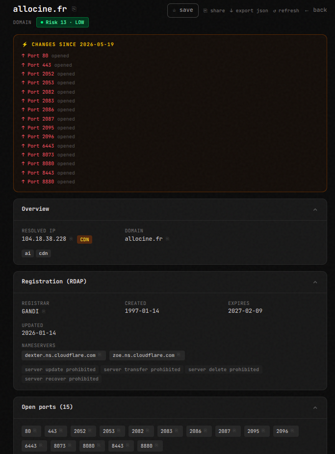
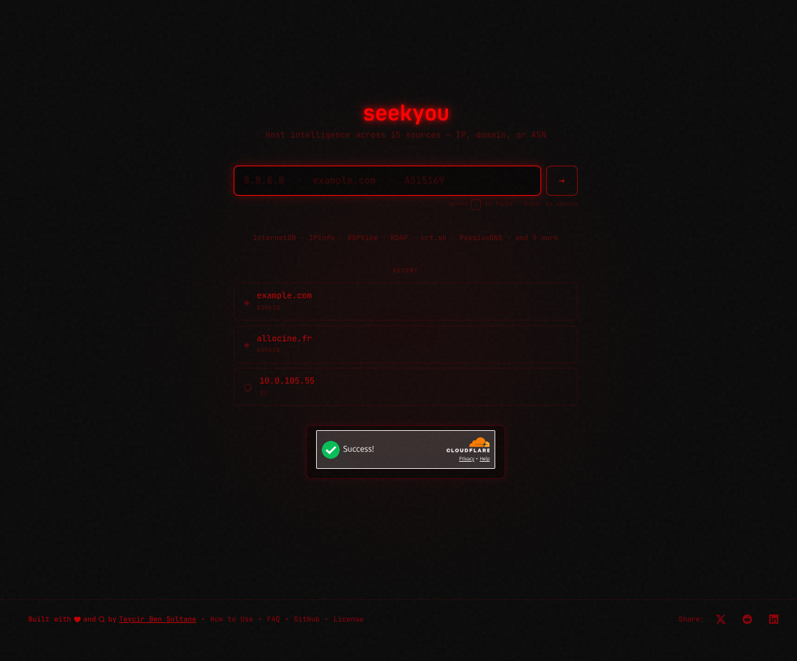

<!-- donation:eth:start -->
<div align="center">

## Support Development

If this project helps your work, support ongoing maintenance and new features.

**ETH Donation Wallet**  
`0x11282eE5726B3370c8B480e321b3B2aA13686582`

<a href="https://etherscan.io/address/0x11282eE5726B3370c8B480e321b3B2aA13686582">
  
</a>

_Scan the QR code or copy the wallet address above._

</div>
<!-- donation:eth:end -->


# SeekYou

> **Unified host intelligence across 15 sources** — Query any IP, domain, or ASN for instant security posture, infrastructure details, and threat correlations. Runs entirely on the Cloudflare free tier.

**Live at:** https://seekyou.seekyou.workers.dev

```
$ curl "https://seekyou.seekyou.workers.dev/api/lookup?q=1.1.1.1"

{
  "query": { "raw": "1.1.1.1", "type": "ip", "normalised": "1.1.1.1" },
  "core": {
    "internetdb":  { "status": "ok",     "data": { "ports": [80,443], "vulns": [] } },
    "geo":         { "status": "cached", "data": { "country": "US", "org": "AS13335 Cloudflare" } },
    "bgp":         { "status": "ok",     "data": { "name": "CLOUDFLARENET", "rir": "ARIN" } },
    ...
  },
  "meta": { "durationMs": 312, "cacheHits": 4, "sourcesQueried": 15, "sourcesFailed": 0 }
}
```

## Screenshots

<div align="center">

### Landing Page


### Results Page


### Results Page (cont.)


### Demo
<a href="https://www.youtube.com/watch?v=b86tAUUqd34">
  
</a>

</div>

---

## Table of Contents

- [SeekYou](#seekyou)
  - [Table of Contents](#table-of-contents)
  - [What SeekYou does](#what-seekyou-does)
  - [Use cases](#use-cases)
  - [Lawful-use policy](#lawful-use-policy)
  - [Related Tools](#related-tools)
  - [Architecture overview](#architecture-overview)
  - [Execution model](#execution-model)
  - [Data sources](#data-sources)
  - [Project structure](#project-structure)
  - [Key design decisions](#key-design-decisions)
    - [Edge-first, no Node.js](#edge-first-no-nodejs)
    - [Layered parallel execution](#layered-parallel-execution)
    - [Graceful degradation](#graceful-degradation)
    - [Aggressive KV caching](#aggressive-kv-caching)
    - [Free-tier optimization](#free-tier-optimization)
    - [Fire-and-forget D1 writes](#fire-and-forget-d1-writes)
  - [Caching strategy](#caching-strategy)
  - [Rate limiting](#rate-limiting)
  - [Circuit breakers](#circuit-breakers)
  - [Key rotation — GrayHatWarfare](#key-rotation--grayhatwarfare)
  - [D1 persistence](#d1-persistence)
    - [Schema (`schema.sql`)](#schema-schemasql)
    - [Apply schema](#apply-schema)
    - [Helper functions](#helper-functions)
  - [Cron worker](#cron-worker)
  - [Development setup](#development-setup)
    - [Prerequisites](#prerequisites)
    - [Local development](#local-development)
    - [Create Cloudflare resources (first time)](#create-cloudflare-resources-first-time)
  - [Deployment](#deployment)
    - [Build and deploy](#build-and-deploy)
    - [Wrangler configuration (`wrangler.toml`)](#wrangler-configuration-wranglertoml)
  - [Secrets and environment variables](#secrets-and-environment-variables)
    - [Required secrets](#required-secrets)
    - [`.env.example` (local dev only)](#envexample-local-dev-only)
  - [Running tests](#running-tests)
  - [Cloudflare free-tier limits](#cloudflare-free-tier-limits)
  - [Roadmap](#roadmap)
  - [License](#license)
  - [Author](#author)
  - [Acknowledgments](#acknowledgments)

---

## What SeekYou does

SeekYou is a **host intelligence tool** — paste in an IP address, domain name, or ASN and get a unified report covering:

| Category | What you get |
|---|---|
| Network | Open ports, CPEs, BGP prefixes, upstreams, peers, RIR |
| Identity | RDAP registration, contacts, registrar, nameservers |
| Geo | Country, city, ISP, proxy / hosting / mobile flags |
| Certificates | crt.sh history, SANs, issuer chain |
| DNS | Passive DNS records, Robtex reverse/forward DNS |
| Threats | URLhaus, ThreatFox, MalwareBazaar, Feodo, SSLBL |
| CVEs | NVD + CIRCL enrichment for every CVE ID InternetDB reports |
| Recon | GrayHatWarfare exposed buckets, Wayback CDX snapshots |

Every source is queried in parallel. A failing source degrades to an "unavailable" badge — it never breaks the page.

---

## Use cases

**Security Operations** — Quickly profile suspicious IPs from logs, correlate IOCs, identify exposed services and CVEs, trace malicious domains.

**Network Operations** — Inspect BGP routing, RDAP/WHOIS allocation data, historical DNS records, SSL cert changes.

**Penetration Testing** — Enumerate ports/services/CPEs, discover exposed buckets, archived pages, subdomains, and ASN relationships.

**Threat Intelligence** — Check C2 infrastructure against five threat feeds in a single query.

**Compliance & Risk** — Profile vendor infrastructure, detect exposed cloud storage, identify shadow IT.

---

## Lawful-use policy

SeekYou is designed for **lawful security research, network operations, and threat intelligence**. By using this tool, you agree to:

**Permitted uses:**
- Security operations and incident response on networks you own or are authorized to monitor
- Threat intelligence research and IOC correlation
- Network troubleshooting and infrastructure auditing within your organization
- Penetration testing with explicit written authorization from the target organization
- Academic research and education in cybersecurity
- Compliance audits and vendor risk assessments with proper authorization

**Prohibited uses:**
- Unauthorized access, reconnaissance, or attacks against systems you do not own or have explicit permission to test
- Harassment, stalking, or privacy violations against individuals or organizations
- Facilitating illegal activities including fraud, identity theft, or cybercrime
- Circumventing security controls or access restrictions without authorization
- Violating applicable laws including CFAA (US), Computer Misuse Act (UK), GDPR (EU), or equivalent legislation in your jurisdiction

**Your responsibilities:**
- Ensure you have proper authorization before querying infrastructure you do not own
- Respect rate limits and do not abuse the service or upstream data sources
- Comply with all applicable laws and regulations in your jurisdiction
- Use the data responsibly and do not weaponize findings without coordinated disclosure
- Understand that querying a host does not grant permission to access or exploit it

**Disclaimer:**
The author and contributors assume no liability for misuse of this tool. Users are solely responsible for ensuring their activities comply with applicable laws. Data aggregated from public sources may be incomplete, outdated, or inaccurate — always verify findings through authoritative channels before taking action.

If you discover a vulnerability through SeekYou, follow responsible disclosure practices and notify the affected party before public disclosure.

---

## Related Tools

SeekYou is part of a privacy-focused security toolkit. Explore the full suite:

| Tool | Description | Live URL |
|---|---|---|
| **TimeSeal** | Cryptographic timestamping service — prove document existence at a specific time without revealing content | [timeseal.online](https://timeseal.online) |
| **SanctumVault** | Zero-knowledge encrypted vault — client-side encryption for sensitive data storage | [sanctumvault.online](https://sanctumvault.online) |
| **GhostChat** | Ephemeral encrypted messaging — self-destructing conversations with no server logs | [ghost-chat.pages.dev](https://ghost-chat.pages.dev) |
| **XMRProof** | Monero payment verification — generate cryptographic proofs of XMR transactions | [xmrproof.pages.dev](https://xmrproof.pages.dev) |
| **GhostReceipt** | Anonymous receipt generation — create verifiable transaction records without identity exposure | [ghostreceipt.pages.dev](https://ghostreceipt.pages.dev) |
| **SeekYou** | Host intelligence aggregator — unified OSINT across 15 sources for IPs, domains, and ASNs | [seekyou.seekyou.workers.dev](https://seekyou.seekyou.workers.dev) |
| **HoneypotScan** | Honeypot detection service — identify decoy systems and avoid false positives in security research | [honeypotscan.pages.dev](https://honeypotscan.pages.dev) |

All tools run on Cloudflare's edge network with privacy-first design principles.

---

## Architecture overview

```
Browser / curl
     │
     ▼
┌─────────────────────────────────────┐
│  Cloudflare Pages                   │
│  Next.js App Router (SSR)           │
│                                     │
│  app/page.tsx          search form  │
│  app/host/[query]/page.tsx          │
│    └─ streams /api/stream?q=…       │
│  app/api/recent/route.ts            │
│    └─ recent searches for homepage  │
│  app/targets/page.tsx               │
│    └─ monitoring dashboard          │
│  app/api/targets/route.ts           │
│    └─ saved targets CRUD            │
│        returns riskScore + lastDiff │
└──────────────┬──────────────────────┘
               │
               ▼
┌─────────────────────────────────────┐
│  app/api/lookup/route.ts            │
│  (Workers runtime via opennextjs)   │
│  • input validation                 │
│  • per-IP rate limiting (KV)        │
│  • ctx.waitUntil(recordSearch())    │
└──────────────┬──────────────────────┘
               │ runLookup()
               ▼
┌─────────────────────────────────────┐
│  worker/lookup.ts  — orchestrator   │
│  4-layer Promise.allSettled         │
└──┬──────────────────────────────────┘
   │
   ├─► Layer 1+2 (parallel, 12 sources):
   │     InternetDB · IPinfo · BGPView · RDAP · crt.sh · PassiveDNS · Robtex
   │     URLhaus · ThreatFox · MalwareBazaar · Feodo · SSLBL
   ├─► Layer 3 (after L1): NVD CVE enrichment (only if vulns found, batched 10-at-a-time)
   └─► Layer 4 (parallel): GrayHatWarfare · Wayback (domain queries only)
               │
               ▼
┌──────────────┐   ┌──────────────────┐
│ KV           │   │ D1               │
│ response     │   │ searches         │
│ cache (TTL   │   │ saved_targets    │
│ per source)  │   │                  │
└──────────────┘   └──────────────────┘
               │
               ▼
┌─────────────────────────────────────┐
│  seekyou-cron (Worker)            │
│  wrangler.cron.toml                 │
│  • hourly blocklist refresh         │
│  • hourly saved-target re-query     │
│    + typed diff (lib/diff.ts)       │
│    + webhook on hasChanges          │
└─────────────────────────────────────┘
```

---

## Execution model

Layers 1 and 2 fire simultaneously (12 sources in one `Promise.allSettled`). Layer 3 starts after Layer 1 settles — CVE IDs from InternetDB drive NVD enrichment, batched 10-at-a-time to avoid stampeding the API. Layer 4 fires in parallel with Layer 3 but only for domain queries; IP/ASN skip it entirely. Total wall-clock time ≈ max(Layer 1+2) + max(Layer 3+4).

Force-refresh any query with `?refresh=1` to bypass the KV cache and pull live data from every upstream.

---

## Data sources

| Layer | Source | What it provides | Auth required |
|---|---|---|---|
| 1 | InternetDB | Open ports, CPEs, CVE IDs | No |
| 1 | IPinfo / ip-api | Geo, ISP, ASN, hosting/proxy/mobile | No |
| 1 | BGPView | BGP prefixes, upstreams, peers, RIR | No |
| 1 | RDAP | Registration, contacts, nameservers, CIDR | No |
| 2 | crt.sh | Certificate history, SANs, issuer chain | No |
| 2 | PassiveDNS | Historical DNS records | No |
| 2 | Robtex | Reverse/forward DNS, AS info | No |
| 2 | URLhaus | Malware distribution URLs | `ABUSECH_KEY` |
| 2 | ThreatFox | IOC database | `ABUSECH_KEY` |
| 2 | MalwareBazaar | Malware sample metadata | `ABUSECH_KEY` |
| 2 | Feodo Tracker | Botnet C2 IPs | No (bulk download) |
| 2 | SSLBL | Malicious SSL certificates | No (bulk download) |
| 3 | NVD + CIRCL | CVE details, CVSS v2/v3 scores | `NVD_KEY` (optional) |
| 4 | GrayHatWarfare | Exposed S3/Azure/GCS buckets | `GRAYHATWARFARE_API_KEY_1..18` |
| 4 | Wayback | Historical CDX snapshots | No |

**Feodo and SSLBL** are fetched as bulk blocklists and refreshed hourly by the cron worker — no per-query upstream call.

---

## Project structure

```
SeekYou/
├── app/
│   ├── page.tsx                      # Homepage — search form + recent searches
│   ├── layout.tsx                    # Root layout
│   ├── globals.css
│   ├── about/                        # About page
│   ├── faq/                          # FAQ page
│   ├── targets/
│   │   └── page.tsx                  # /targets — monitoring dashboard (risk + diffs)
│   ├── host/[query]/
│   │   └── page.tsx                  # SSR host report page (streams via /api/stream)
│   ├── api/
│   │   ├── lookup/route.ts           # GET /api/lookup?q=&refresh=1
│   │   ├── stream/route.ts           # GET /api/stream?q= (SSE streaming)
│   │   ├── recent/route.ts           # GET /api/recent?limit=5
│   │   ├── batch/route.ts            # POST /api/batch (multi-query)
│   │   ├── targets/route.ts          # GET /api/targets (+ riskScore, lastDiff) · POST
│   │   ├── targets/[id]/route.ts     # DELETE /api/targets/:id
│   │   └── admin/reset-breaker/      # POST — manual circuit-breaker reset
│   └── components/
│       ├── AnimatedTagline.tsx
│       ├── Card.tsx
│       ├── CopyButton.tsx
│       ├── CveDrawer.tsx
│       ├── DecryptedText.tsx
│       ├── ExportButton.tsx          # JSON export (client, zero backend)
│       ├── Footer.tsx
│       ├── RecentSearches.tsx        # Recent queries from D1 (client)
│       ├── RiskBadge.tsx             # Risk score pill with breakdown tooltip
│       ├── SaveButton.tsx            # Save/unsave target
│       ├── ScrollProgress.tsx
│       ├── ShareButton.tsx
│       ├── VulnsStream.tsx           # Streaming CVE results
│       └── ui/                       # Shared UI primitives
├── worker/
│   ├── lookup.ts                     # 4-layer orchestrator
│   ├── cron.ts                       # Hourly blocklist refresh + target sweep w/ typed diff
│   ├── index.ts
│   └── sources/
│       ├── internetdb.ts
│       ├── ipapi.ts
│       ├── bgpview.ts
│       ├── rdap.ts
│       ├── crtsh.ts
│       ├── passivedns.ts
│       ├── robtex.ts
│       ├── abusech.ts                # URLhaus + ThreatFox + MalwareBazaar
│       ├── nvd.ts                    # NVD + CIRCL CVE enrichment
│       ├── osv.ts                    # OSV.dev re-export (via nvd.ts)
│       ├── grayhatwarfare.ts
│       └── wayback.ts
├── lib/
│   ├── types.ts                      # All TypeScript interfaces
│   ├── cache.ts                      # KV cache wrapper (bypass on forceRefresh)
│   ├── config.ts                     # All magic numbers: TTLs, timeouts, limits
│   ├── diff.ts                       # TargetDiff — typed change detection between snapshots
│   ├── errors.ts                     # Unified error format + ErrorCode enum
│   ├── hooks.ts                      # Shared React hooks
│   ├── keyring.ts                    # GHW 18-key rotation
│   ├── logger.ts                     # Structured logging
│   ├── merge.ts                      # Result merging
│   ├── normalize.ts                  # Threat indicator normalization
│   ├── ratelimit.ts                  # KV-based per-IP rate limiter + circuit breakers
│   ├── results.ts                    # SourceResult helpers
│   ├── risk.ts                       # computeRiskScore — scored 0–100 with breakdown
│   ├── searches.ts                   # D1 helpers: recordSearch, getRecentSearches
│   ├── targets.ts                    # D1 helpers: saveTarget, listTargets, removeTarget
│   ├── textAnimation.ts              # Text animation utility
│   ├── useHostStream.ts              # SSE streaming hook for host results
│   ├── validate.ts                   # Query parsing (IPv4/v6/domain/ASN)
│   └── utils.ts
├── test/
│   ├── cache.test.ts
│   ├── diff.test.ts                  # Tests for diffHostResults + summariseDiff
│   ├── keyring.test.ts
│   ├── logger.test.ts
│   ├── merge.test.ts
│   ├── normalize.test.ts
│   ├── results.test.ts
│   ├── risk.test.ts
│   ├── validate.test.ts
│   └── sources/
├── docs/
│   ├── ROADMAP.md
│   ├── Spec.md
│   └── LICENSE.md
├── public/
│   └── publiceth.svg                 # Donation QR code
├── schema.sql                        # D1 schema (apply with wrangler d1 execute)
├── wrangler.toml                     # Pages build config (KV + D1 bindings)
├── wrangler.cron.toml                # Cron worker config (separate deploy)
├── next.config.ts
├── open-next.config.ts
└── vitest.config.ts
```

---

## Key design decisions

### Edge-first, no Node.js
Workers runtime via `@opennextjs/cloudflare` — no `runtime = 'edge'` export needed. Pure Web APIs throughout. Cold starts under 50 ms globally.

### Layered parallel execution
Layers 1+2 fire together (12 sources). Layer 3 (CVE enrichment) only runs if InternetDB finds vulns, batched 10-at-a-time. Layer 4 (GHW + Wayback) runs in parallel with Layer 3, but is skipped entirely for IP/ASN queries. Total time ≈ slowest source in each wave, not the sum of all sources.

### Graceful degradation
Every source is wrapped in a circuit breaker + try/catch. A failed source becomes an `{ status: 'error' }` badge. The page always renders.

### Aggressive KV caching
Each source has its own TTL (30 days for CVEs, 24h for BGP/RDAP, 1h for core geo/ports, 30m for abuse.ch). Cache hits bypass external calls entirely. `?refresh=1` threads `forceRefresh: true` through every fetcher to bypass cache on demand.

### Free-tier optimization
GrayHatWarfare has 18-key rotation (1,800 req/day). NVD uses request batching (10 concurrent max). Feodo/SSLBL are fetched as bulk lists by the cron worker and cached in KV — zero per-query upstream cost.

### Fire-and-forget D1 writes
`recordSearch()` is called inside `ctx.waitUntil()` — it does not add any latency to the API response. D1 writes happen after the response is flushed.

---

## Caching strategy

```typescript
// lib/cache.ts
export async function cacheGet<T>(
  kv: KVNamespace,
  key: string,
  bypass?: boolean,        // true when ?refresh=1
): Promise<T | null>

export async function cacheSet<T>(
  kv: KVNamespace,
  key: string,
  value: T,
  ttlSeconds?: number,
): Promise<void>
```

Cache keys follow the pattern `source:normalised_query` — e.g. `internetdb:1.1.1.1`, `crtsh:example.com`.

TTLs by source (from `lib/config.ts`):

| Source(s) | TTL |
|---|---|
| CVE (NVD/CIRCL) | 30 days |
| Wayback | 7 days |
| BGP, RDAP, Robtex | 24 hours |
| crt.sh, PassiveDNS | 12 hours |
| GrayHatWarfare | 6 hours |
| InternetDB, IPinfo | 1 hour |
| Feodo, SSLBL (bulk) | 1 hour |
| URLhaus, ThreatFox, MalwareBazaar | 30 minutes |

Errors are never cached — a failed fetch always retries on the next request.

---

## Rate limiting

KV-based sliding window: **100 requests per IP per hour**. Implemented in `lib/ratelimit.ts`, enforced in `app/api/lookup/route.ts` before any lookup runs.

Rate-limit headers are returned on every response:

```
X-RateLimit-Limit: 100
X-RateLimit-Remaining: 87
X-RateLimit-Reset: 1716912000
```

On exhaustion, the API returns `429` with `Retry-After`.

---

## Circuit breakers

Each source has a circuit breaker tracked in KV. If a source exceeds **50% failure rate** in a 5-minute window (minimum 4 requests), the breaker opens and the source is skipped (returns `{ status: 'skipped' }`) for **15 minutes**, then auto-recovers.

The current state of every breaker is included in `meta.circuitBreakers` on every API response.

To manually reset a breaker in production:

```bash
curl -X POST https://seekyou.seekyou.workers.dev/api/admin/reset-breaker \
  -H "Authorization: Bearer $ADMIN_TOKEN" \
  -H "Content-Type: application/json" \
  -d '{"source": "nvd"}'
```

---

## Key rotation — GrayHatWarfare

GrayHatWarfare allows 100 requests/day per API key. SeekYou rotates across up to 18 keys for an effective 1,800 requests/day:

```typescript
// lib/keyring.ts — round-robin across keys with remaining quota
const key = await keyRing.next(env, 'GRAYHATWARFARE_API_KEY')
```

Keys are named `GRAYHATWARFARE_API_KEY_1` through `GRAYHATWARFARE_API_KEY_18` and stored as Wrangler secrets.

---

## D1 persistence

### Schema (`schema.sql`)

```sql
CREATE TABLE IF NOT EXISTS searches (
  id          TEXT PRIMARY KEY DEFAULT (lower(hex(randomblob(8)))),
  query       TEXT NOT NULL,
  query_type  TEXT NOT NULL CHECK (query_type IN ('ip','domain','asn')),
  result_json TEXT NOT NULL,
  duration_ms INTEGER,
  created_at  INTEGER NOT NULL DEFAULT (unixepoch())
);

CREATE INDEX IF NOT EXISTS idx_searches_query
  ON searches (query, created_at DESC);

CREATE TABLE IF NOT EXISTS saved_targets (
  id          TEXT PRIMARY KEY DEFAULT (lower(hex(randomblob(8)))),
  query       TEXT NOT NULL UNIQUE,
  label       TEXT,
  notes       TEXT,
  result_json TEXT,       -- snapshot of last cron lookup
  checked_at  INTEGER,    -- unix seconds — when cron last re-queried
  created_at  INTEGER NOT NULL DEFAULT (unixepoch())
);

CREATE INDEX IF NOT EXISTS idx_saved_targets_created
  ON saved_targets (created_at DESC);
```

### Apply schema

```bash
wrangler d1 execute seekyou --file=schema.sql
```

### Helper functions

**`lib/searches.ts`** — search history:
```typescript
// Write a search row (fire-and-forget safe)
await recordSearch(db, query, queryType, resultJson, durationMs)

// Read last N distinct queries for the homepage (default 5)
const recent = await getRecentSearches(db, 5)
// → [{ query: '1.1.1.1', query_type: 'ip', created_at: 1716912000 }, ...]
```

**`lib/targets.ts`** — saved targets:
```typescript
// Upsert a target (idempotent on query)
const id = await saveTarget(db, query, label, notes)

// List all saved targets
const targets = await listTargets(db)

// Remove by id
await removeTarget(db, id)

// Fetch one (used by cron before re-querying)
const target = await getTarget(db, id)

// Write latest snapshot after cron re-query
await updateTargetSnapshot(db, id, resultJson)
```

---

## Cron worker

A standalone Worker (`worker/cron.ts`) is deployed separately via `wrangler.cron.toml`. It runs on an **hourly trigger** and performs two jobs:

1. **Blocklist refresh** — checks if Feodo/SSLBL bulk lists are stale and re-downloads them if needed.
2. **Saved-target sweep** — re-queries every saved target, computes a typed `TargetDiff`, persists the fresh snapshot to D1, and POSTs a webhook payload when changes are detected.

### Typed diff (`lib/diff.ts`)

After each re-query, `diffHostResults(prev, next)` produces a structured `TargetDiff` covering:

| Signal | What it detects |
|---|---|
| `ports` | Opened / closed ports (direction per port) |
| `cves` | CVEs appeared / resolved, with CVSS severity and score |
| `threats` | URLhaus, Feodo, SSLBL, ThreatFox feed changes |
| `geo` | Country, ASN, or primary hostname changes |
| `certExpiry` | Certs expiring within 30 days or newly expired (fires once per cert) |
| `risk` | Risk score delta — only surfaces in `hasChanges` when Δ ≥ 5 points |

`summariseDiff(diff, query)` converts the struct to a human-readable string for logs and webhook relay.

### Webhook payload

When `diff.hasChanges` is true and `WEBHOOK_URL` is set, the cron POSTs:

```json
{
  "sentAt": 1716912000,
  "events": [
    {
      "targetId": "abc123",
      "query": "1.2.3.4",
      "checkedAt": 1716912000,
      "summary": "1.2.3.4:\n  port 3389 opened\n  CVE-2021-44228 appeared [CRITICAL 10]",
      "diff": {
        "diffedAt": 1716912000,
        "hasChanges": true,
        "ports": [{ "port": 3389, "direction": "opened" }],
        "cves": [{ "id": "CVE-2021-44228", "direction": "appeared", "severity": "CRITICAL", "score": 10 }],
        "threats": [],
        "geo": [],
        "certExpiry": [],
        "risk": { "prev": 20, "next": 55, "delta": 35 }
      }
    }
  ]
}
```

The `diff` field is fully structured — consumers can branch on specific change types without parsing string lines. The `summary` field is pre-formatted for Slack/Discord relays.

Deploy the cron worker:

```bash
wrangler deploy --config wrangler.cron.toml
```

Secrets for the cron worker are set separately:

```bash
wrangler secret put NVD_KEY     --config wrangler.cron.toml
wrangler secret put ABUSECH_KEY --config wrangler.cron.toml
wrangler secret put WEBHOOK_URL --config wrangler.cron.toml  # optional — fires on any hasChanges
```

---

## Development setup

### Prerequisites

- Node.js 18+
- Wrangler CLI (`npm i -g wrangler`)
- Cloudflare account (free tier is sufficient)

### Local development

```bash
git clone https://github.com/Teycir/SeekYou
cd SeekYou
npm install

# Copy example env — fill in your keys
cp .env.example .env

# Run Next.js dev server (KV/D1 stubbed via Wrangler local)
npm run dev
```

The app is available at `http://localhost:3000`. In local dev, KV and D1 use Wrangler's local SQLite-backed emulation — no Cloudflare account access needed for basic testing.

### Create Cloudflare resources (first time)

```bash
# Create KV namespace — copy the ID into wrangler.toml
wrangler kv namespace create KV

# Create D1 database — copy the ID into wrangler.toml
wrangler d1 create seekyou

# Apply schema
wrangler d1 execute seekyou --file=schema.sql
```

---

## Deployment

### Build and deploy

```bash
# Build + deploy to Cloudflare Pages
bash scripts/deploy.sh
```

The script runs `opennextjs-cloudflare build`, prepares the Pages output directory, and calls `wrangler pages deploy .open-next`. Do **not** use `npm run deploy` or bare `wrangler deploy` — those target the Workers (non-Pages) runtime and will fail.

To deploy the cron worker separately:

```bash
wrangler deploy --config wrangler.cron.toml
```

### Wrangler configuration (`wrangler.toml`)

```toml
name = "seekyou"
pages_build_output_dir = ".open-next"
compatibility_date = "2025-05-01"
compatibility_flags = ["nodejs_compat"]

[[kv_namespaces]]
binding = "KV"
id = "<your-kv-id>"

[[d1_databases]]
binding = "DB"
database_name = "seekyou"
database_id = "<your-d1-id>"
```

---

## Secrets and environment variables

All secrets are stored as Wrangler secrets — never in source code or `.env`.

### Required secrets

```bash
wrangler secret put NVD_KEY             # NVD API key (optional — higher rate limits)
wrangler secret put ABUSECH_KEY         # abuse.ch API key (URLhaus/ThreatFox/MalwareBazaar)
wrangler secret put ADMIN_TOKEN         # Bearer token for /api/admin/* endpoints

# GrayHatWarfare — repeat for each key you have (1–18)
wrangler secret put GRAYHATWARFARE_API_KEY_1
wrangler secret put GRAYHATWARFARE_API_KEY_2
# ... up to GRAYHATWARFARE_API_KEY_18
```

### `.env.example` (local dev only)

```bash
NVD_KEY=your_nvd_key_here
ABUSECH_KEY=your_abusech_key_here
ADMIN_TOKEN=change_me
GRAYHATWARFARE_API_KEY_1=your_ghw_key_here
```

> **Security note:** Never commit `.env`. It is in `.gitignore`. If secrets were ever committed, rotate all keys and clean git history with BFG (`bfg --delete-files .env`).

---

## Running tests

```bash
# All unit tests
npm test

# Watch mode
npm run test:watch

# Specific file
npm test -- test/cache.test.ts
```

Tests use Vitest. See `vitest.config.ts`.

---

## Cloudflare free-tier limits

| Service | Free allowance | Estimated SeekYou usage |
|---|---|---|
| Pages builds | 500/month | ~10 deploys/month |
| Workers requests | 100k/day | ~5k lookups/day |
| KV reads | 100k/day | ~75k reads/day (15 sources × 5k) |
| KV writes | 1k/day | ~500 writes/day |
| D1 reads | 5M rows/day | ~5k rows/day |
| D1 writes | 100k rows/day | ~500 rows/day |

**Estimated capacity:** ~5,000 unique lookups/day comfortably within free tier.

Caching means most lookups consume 0 upstream calls and very few KV writes. Popular queries are nearly free after the first hit.

---

## Roadmap

See [docs/ROADMAP.md](docs/ROADMAP.md) for the full phased roadmap.

**Completed highlights:**
- ✅ Per-IP rate limiting (KV sliding window, 100 req/hour)
- ✅ Unified error format (`lib/errors.ts`, `ErrorCode` enum)
- ✅ Centralised config (`lib/config.ts` — all TTLs, timeouts, limits)
- ✅ Circuit breakers per source with `/api/admin/reset-breaker`
- ✅ `?refresh=1` force-cache-bypass threads through all fetchers
- ✅ JSON export button (client-side, zero backend)
- ✅ Recent searches on homepage (D1, deduped, capped at 5)
- ✅ Saved targets (D1 CRUD, `/api/targets`)
- ✅ SSE streaming results (`/api/stream`, `useHostStream`)
- ✅ Batch CVE enrichment (10 concurrent, `lib/config.ts CVE.MAX_CONCURRENT`)
- ✅ Cron worker — hourly blocklist refresh + hourly target re-query
- ✅ Risk scoring (`lib/risk.ts`) — 0–100 score with per-category breakdown
- ✅ Typed diff (`lib/diff.ts`) — `TargetDiff` with ports, CVEs, threats, geo, cert expiry, risk delta
- ✅ Webhook diff — structured `TargetDiff` payload dispatched from cron on `hasChanges`
- ✅ GET `/api/targets` enriched with `riskScore` and `lastDiff` per target
- ✅ `/targets` monitoring dashboard — risk pills, diff chips, 60 s polling

**Up next (ordered by priority):**
- [ ] Turnstile abuse defense — Cloudflare widget + server-side token validation in `/api/lookup`
- [ ] `/api/admin/health` — aggregate breaker states, KV hit rates, recent error trends
- [ ] Batch lookup proper orchestration — deduplicated enrichment, shared cache reuse, progressive NDJSON streaming per item
- [ ] Persist `last_diff_json` column in `saved_targets` — surface diff history across multiple cron runs

---

## License

**Business Source License 1.1 (BSL)**

Copyright © 2026 Teycir Ben Soltane <teycir@pxdmail.net>

Permitted: personal use, research, education, non-commercial projects, internal business tools.  
Restricted: commercial SaaS offerings, reselling as a service, competitive products.

After 4 years from the release date, this software converts to Apache 2.0.

See [docs/LICENSE.md](docs/LICENSE.md) for full terms.

---

## Author

**Teycir Ben Soltane**  
Email: teycir@pxdmail.net  
GitHub: [@Teycir](https://github.com/Teycir)

---

## Acknowledgments

- [InternetDB](https://internetdb.shodan.io) (Shodan)
- [IPinfo](https://ipinfo.io) / [ip-api](https://ip-api.com)
- [BGPView](https://bgpview.io)
- [RDAP](https://rdap.org)
- [crt.sh](https://crt.sh)
- [PassiveDNS](https://passivedns.cn)
- [Robtex](https://www.robtex.com)
- [abuse.ch](https://abuse.ch) — URLhaus, ThreatFox, MalwareBazaar, Feodo, SSLBL
- [NVD](https://nvd.nist.gov) (NIST)
- [CIRCL](https://www.circl.lu/services/cve-search/)
- [OSV.dev](https://osv.dev)
- [GrayHatWarfare](https://grayhatwarfare.com)
- [Internet Archive](https://web.archive.org) (Wayback Machine)

---
